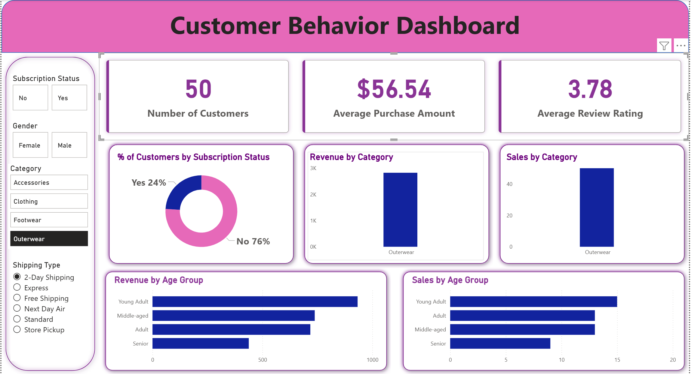

# Retail Consumer Behavior Analysis

## Project Overview
This project aims to analyze customer shopping behavior for a leading retail company to improve sales, customer satisfaction, and long-term loyalty. By leveraging Python, SQL, and Power BI, the analysis uncovers trends across demographics, product categories, and sales channels to provide data-driven business recommendations.

### Business Question
> *"How can the company leverage consumer shopping data to identify trends, improve customer engagement, and optimize marketing and product strategies?"*

## Key Deliverables
1.  **Data Preparation & Modeling (Python):** Cleaned and transformed raw datasets to ensure data integrity and readiness for analysis.
2.  **Data Analysis (SQL):** Structured data into a relational format, simulated business transactions, and queried insights on customer segments, loyalty, and purchase drivers.
3.  **Visualization & Insights (Power BI):** Developed an interactive dashboard highlighting key patterns, seasonal trends, and payment preferences.
4.  **Actionable Recommendations:** Identified high-impact factors such as discount effectiveness and review scores to drive repeat purchases.

## Dashboard Preview

## Technical Stack
- **Data Cleaning:** Python (Pandas, NumPy)
- **Database Management:** SQL
- **Data Visualization:** Power BI
- **Documentation:** Markdown

## Key Insights
- **Demographic Trends:** Identified which age groups and genders contribute most to revenue across online and offline channels.
- **Purchase Drivers:** Analyzed the correlation between discounts, high review ratings, and customer retention.
- **Channel Performance:** Evaluated the performance of online vs. offline sales to optimize inventory and marketing spend.

## How to Use This Repository
1. **Scripts:** Navigate to the `/scripts` folder for Python notebooks used for ETL processes.
2. **SQL Queries:** Find the `/sql` directory for the database schema and analytical queries.
3. **Power BI:** Open the `.pbix` file to interact with the full dashboard.

---
*Created as part of a Retail Analytics Case Study.*
